# chem4all

A Python tool that makes chemistry course handouts and presentations accessible to visually impaired students.

chem4all processes PPTX and DOCX files, extracts images, identifies chemical structures using [DECIMER Image Transformer](https://github.com/Kohulan/DECIMER-Image_Transformer), and writes approved alt-text back to the original document. For each image the instructor can choose to produce any combination of a SMILES string, an IUPAC name, a common name, and/or a plain-English description — useful for non-chemical images like cell membranes and biochemical pathway diagrams.

---

## ⚠️ Prototype software — please read before use

**chem4all is prototype/experimental software.** It is provided for testing, evaluation, and research purposes only, and is **not** intended for production, clinical, safety-critical, or other high-stakes use. Do not depend on it as the sole means of producing accessible course materials without independent review of the output by a qualified person — this is especially important for AI-generated chemical structure identifications (SMILES, IUPAC/common names) and image descriptions, which may be inaccurate or misleading if used unreviewed.

**No warranty.** This software is provided "AS IS", without warranty of any kind, express or implied, including but not limited to the implied warranties of **merchantability**, **fitness for a particular purpose**, and **noninfringement**. The maintainer(s) make no representation or guarantee regarding the accuracy, reliability, or completeness of chem4all or any output it generates.

**No liability.** To the maximum extent permitted by law, the maintainer(s) of this project shall not be held liable for any claim, damages, or other liability — whether in an action of contract, tort, or otherwise — arising from, out of, or in connection with the software or its use. You use chem4all entirely at your own risk. (These terms reinforce, and do not replace, the warranty and liability disclaimers already present in the [GPLv3 license](LICENSE), sections 15–16.)

**Limited support and maintenance.** This project is maintained on a best-effort, volunteer basis. No guarantee is made about the duration of support for any publicly released version, the frequency of updates, or the resolution of bugs or feature requests. Maintenance may be reduced or may end at any time, without notice.

**Source availability.** For as long as public versions of chem4all continue to be distributed, the corresponding source code will remain publicly accessible, consistent with the terms of the GPLv3 license.

---

## Screenshots

On launch, chem4all loads the DECIMER model in the background and shows progress on a splash screen:

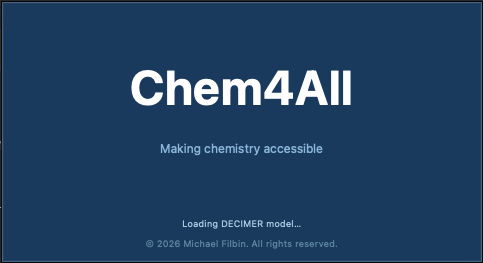

Once the model is loaded, the main screen reports the load time and lets you open a `.pptx` or `.docx` file, or open Settings. You can also drag and drop a file onto the window to open it:

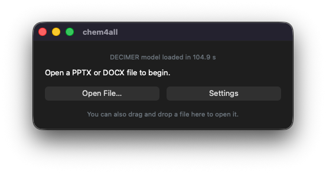

If the DECIMER model hasn't been downloaded yet, the main screen instead shows a banner explaining that chemical structure recognition won't work until it's installed, with a button to download it (~600 MB):

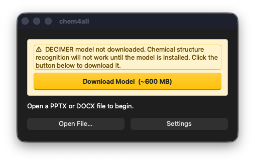

Clicking **Download Model** starts the download in place, showing live progress and transfer size while the rest of the window stays visible:

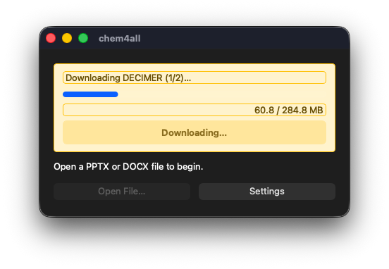

Once the download finishes, chem4all offers to restart so the model is loaded into memory right away:

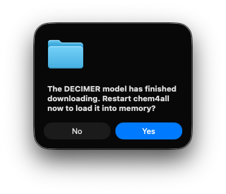

The Settings dialog controls thumbnail and recognition image sizes, output mode (new file vs. in-place), review page size, your OpenRouter API key, and shows where DECIMER's model files are stored on disk. It also has a **Diagnostic Logging** section, off by default, that writes a timestamped log file per session to a folder you choose (defaults to `~/Desktop/chem4all-logs/`). When enabled, it captures document opens, per-image extraction and DECIMER recognition, OpenRouter calls (IUPAC/common name lookup, image descriptions), DECIMER model load timing, and file writes — with timing and results for each step. This is the file to enable and attach when reporting a bug: it gives a developer a step-by-step trace of what chem4all did without needing you to reproduce the issue live:

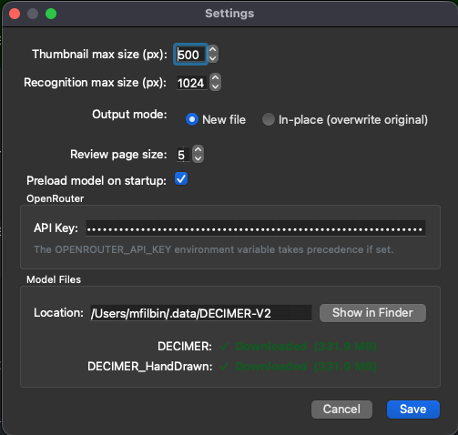

After a file is opened and its images extracted, the Select Images screen lists every image found, each with a checkbox and a checkbox for each prediction type — SMILES, IUPAC name, common name, and/or a plain-language description — so more than one can be requested per image. A "Toggle All" button for each prediction type lets you turn that checkbox on or off for every image at once:

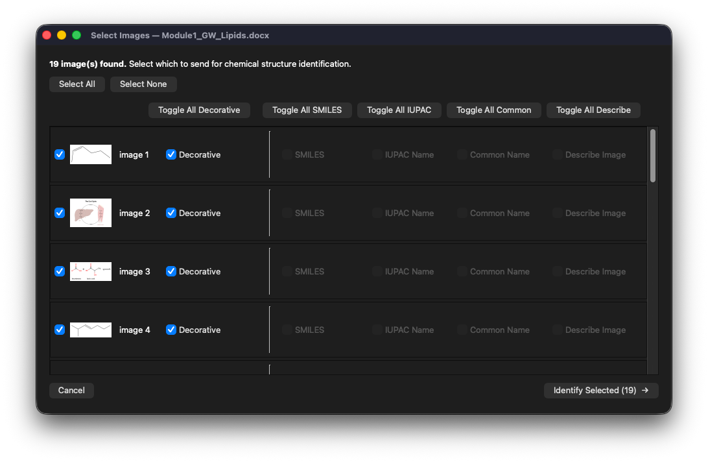

While identification runs, the Review screen updates live with a progress banner and fills in predicted results as they finish; each image's field stays read-only until all of its requested predictions have returned. Once ready, each image's editable text box shows every requested prediction on its own line, labeled with color-coded pills for each prediction type (SMILES, IUPAC, Common, Description) — type directly in the box to override the value(s), or clear it to exclude that image. A **Restore predicted value** button appears whenever you've changed a field, letting you undo back to the original prediction(s):

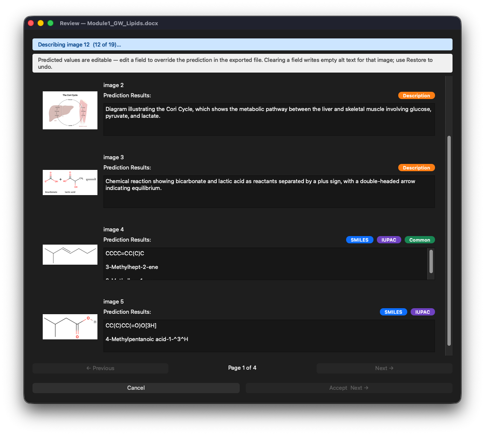

Once you accept the results, chem4all confirms where the accessible file was written and offers to open it directly:

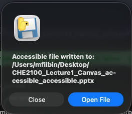

### The result

The written alt-text shows up as native PowerPoint/Word alt-text, ready for any screen reader:

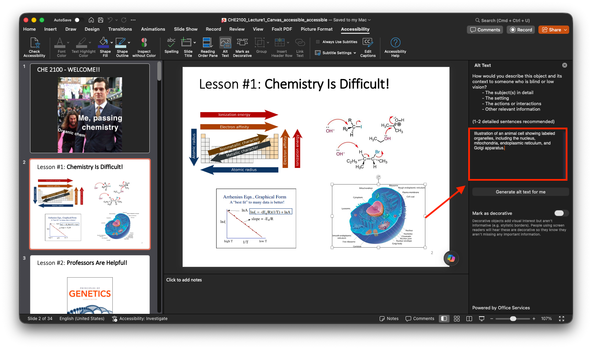

## How it works

1. **Extract** — images are pulled from your PPTX or DOCX file and downscaled for processing
2. **Select** — choose which images to process and what kind of output to produce for each (SMILES, IUPAC name, common name, or image description)
3. **Recognize** — DECIMER identifies chemical structures; non-chemical images are described by GPT-4o vision via OpenRouter
4. **Review** — an instructor approves, edits, or overrides each prediction
5. **Write** — approved alt-text is written back to the document

## Requirements

- Python 3.9–3.12 — TensorFlow (required by DECIMER) does not publish wheels for Python 3.13+
- Homebrew (macOS only, source install only) — required for the `cairo` system library used for SVG support. Not needed if you download the packaged `.app` — cairo is bundled.
- An [OpenRouter](https://openrouter.ai) API key if you intend to use IUPAC name lookup, common name lookup, or image description (not needed for SMILES-only use)

## Installation

### Option A: Download the app (recommended for most users)

1. Download the `.dmg` for your Mac from the [latest release](../../releases/latest). Currently only Apple Silicon (`arm64`) Macs are supported — Intel and Windows builds are planned for a future release.
2. Open the `.dmg` and drag `chem4all.app` to your Applications folder:

   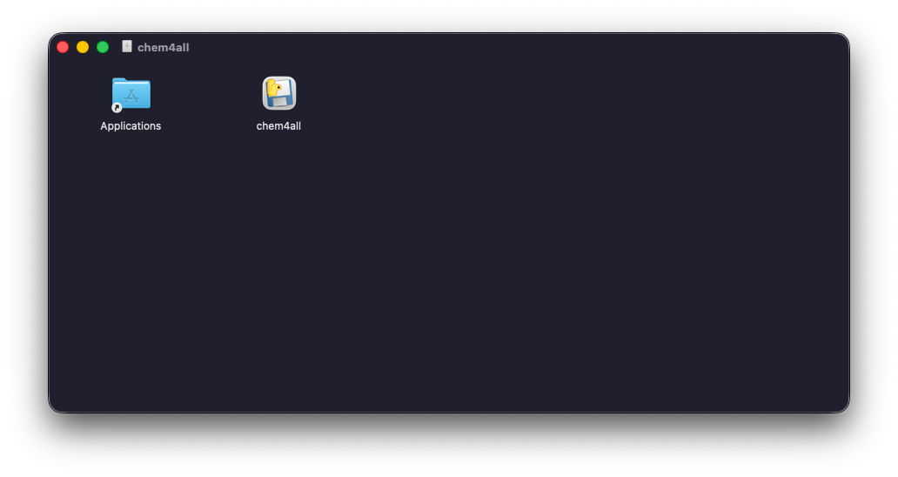

3. Launch chem4all from Applications. No Python, Homebrew, or terminal setup is required — the app is self-contained except for the DECIMER model, which downloads automatically on first use.

### Option B: Run from source (for development)

#### 1. Clone the repository

```bash
git clone <repo-url>
cd chem4all
```

#### 2. Run the setup script

```bash
./setup.sh
```

The script installs all Python dependencies directly into the active interpreter using `pip install -e .`. No virtual environment is created or required.

#### 3. (Optional) Pre-download the DECIMER model

The DECIMER model (~500 MB) is downloaded on first use. To fetch it now so the GUI starts immediately:

```bash
python3 main.py --download-model
```

> **Note:** Ensure you have a stable internet connection and at least 2 GB of free disk space.

#### 4. (Optional) Configure your OpenRouter API key

Set the environment variable before launching, or enter the key in the GUI under **Settings**:

```bash
export OPENROUTER_API_KEY=sk-or-...
```

The environment variable takes precedence over the value stored in settings.

## Usage

### GUI (recommended)

Launch the GUI with no arguments:

```bash
python main.py
# or, if installed as a package:
chem4all
```

**File picker** — click **Open File…** to select a `.pptx` or `.docx` file. While the document is being processed an extraction progress bar shows how many images have been found. If the DECIMER model was pre-downloaded, a load time is shown after startup.

**Select Images** — each extracted image is shown with a checkbox and four prediction-type checkboxes, so you can request more than one prediction per image:

| Option | What it produces |
|---|---|
| SMILES | The SMILES string of the chemical structure (DECIMER) |
| IUPAC Name | Human-readable IUPAC name derived from the SMILES (GPT-4o via OpenRouter) |
| Common Name | Everyday common name derived from the SMILES (GPT-4o via OpenRouter) |
| Describe Image | Single-sentence alt-text description for non-chemical images (GPT-4o vision via OpenRouter) |

Uncheck an image to exclude it from processing. Each included image needs at least one prediction type checked, or an error banner blocks the button. Click **Identify Selected** when ready.

**Review** — each image is shown with its predicted result(s) in one editable text box, one prediction per line if more than one type was requested; the box stays read-only until all of that image's predictions have returned. Leave it as-is to accept the prediction, edit it to override the value, or clear it to exclude that image; a **Restore predicted value** button lets you undo an edit back to the original prediction(s). Use **Previous / Next** to page through results (5 per page by default) — edits persist as you navigate. Click **Accept & Finish** on the last page to write alt-text back to the document.

### CLI

```
chem4all [FILE] [OPTIONS]
```

| Argument | Description |
|---|---|
| `FILE` | Path to a `.pptx` or `.docx` file |
| `--review` | Write a JSON review file instead of auto-accepting predictions |
| `--in-place` | Overwrite the original file (default: creates `filename_accessible.pptx`) |
| `--output PATH` | Explicit output file path |
| `--config PATH` | Use a custom config file instead of `~/.chem4all/config.json` |
| `--download-model` | Pre-download the DECIMER model and exit |

> **Note:** The CLI path produces SMILES only. IUPAC name lookup, common name lookup, and image description are GUI features.

#### Examples

```bash
# Auto-accept all predictions and produce a new accessible file:
chem4all lecture.pptx

# Generate a review file for manual editing:
chem4all lecture.pptx --review

# Overwrite the original file:
chem4all handout.docx --in-place

# Specify an explicit output path:
chem4all lecture.pptx --output /shared/lecture_accessible.pptx
```

## Configuration

Settings are stored in `~/.chem4all/config.json` and created with defaults on first run. You can edit this file directly or use the **Settings** dialog in the GUI.

| Setting | Default | Description |
|---|---|---|
| `auto_filter` | `false` | Hide images below the confidence threshold before showing the review UI |
| `confidence_threshold` | `0.7` | Minimum DECIMER confidence score required when `auto_filter` is enabled |
| `thumbnail_max_size` | `256` | Maximum pixel dimension for thumbnails shown in the review UI |
| `recognition_max_size` | `1024` | Maximum pixel dimension of images sent to DECIMER |
| `output_mode` | `"new_file"` | `"new_file"` creates a new file; `"in_place"` overwrites the original |
| `page_size` | `5` | Number of images shown per page in the review UI |
| `openrouter_api_key` | `""` | OpenRouter API key (overridden by the `OPENROUTER_API_KEY` environment variable) |
| `diagnostic_logging_enabled` | `false` | Write a diagnostic log file per session, for troubleshooting |
| `diagnostic_log_dir` | `~/Desktop/chem4all-logs` | Folder where diagnostic log files are written |

## Running tests

```bash
pytest
```

## Project structure

```
chem4all/
├── main.py                  # Entry point (CLI + GUI launcher)
├── config.py                # Configuration loading and saving
├── setup.sh                 # Dependency installer
├── models/
│   └── image_record.py      # Shared ImageRecord dataclass
├── pipeline/
│   ├── extractor.py         # Extract images from PPTX/DOCX
│   ├── recognizer.py        # Run DECIMER on images
│   ├── namer.py             # IUPAC and common name lookup via OpenRouter
│   ├── describer.py         # Image description via GPT-4o vision
│   ├── reviewer.py          # CLI auto-accept and review file I/O
│   └── writer.py            # Write alt-text back to documents
├── gui/
│   ├── app.py               # PyQt6 application bootstrap
│   ├── splash.py            # Startup splash screen
│   ├── file_picker.py       # Initial file selection window
│   ├── selection_window.py  # Per-image type selection UI
│   ├── review_window.py     # Paged review UI
│   ├── settings_dialog.py   # Settings editor dialog
│   ├── worker.py            # Background QThread for recognition
│   ├── extractor_worker.py  # Background QThread for extraction
│   ├── model_manager.py     # DECIMER model download and preload
│   └── widgets.py           # Shared UI components (ThumbnailLabel)
└── tests/
```

## Known limitations

- **CLI is SMILES-only** — IUPAC name lookup, common name lookup, and image description are available in the GUI only.
- **DECIMER load time** — the TensorFlow model takes ~60–100 s to load on CPU. `tensorflow-metal` (Apple Silicon GPU acceleration) is not yet compatible with TensorFlow 2.16+ and Python 3.12, so CPU is the only supported backend.
- **DOCX image indexing** — images in DOCX files are indexed by relationship ID, which may not match visual reading order in complex layouts. PPTX support is more robust.
- **No review file apply** — the `--review` flag generates a JSON review file, but applying a previously-saved review back via CLI is not yet implemented.

## License

chem4all is licensed under the [GNU General Public License v3.0](LICENSE) (GPLv3).

This is required by the GUI framework, [PyQt6](https://www.riverbankcomputing.com/software/pyqt/), which Riverbank Computing licenses as GPLv3 or a paid commercial license (no permissive tier). Since PyQt6 is bundled directly into the packaged app, the distributed `.app`/`.dmg` is a GPLv3-covered work, and chem4all's own source is licensed to match.
